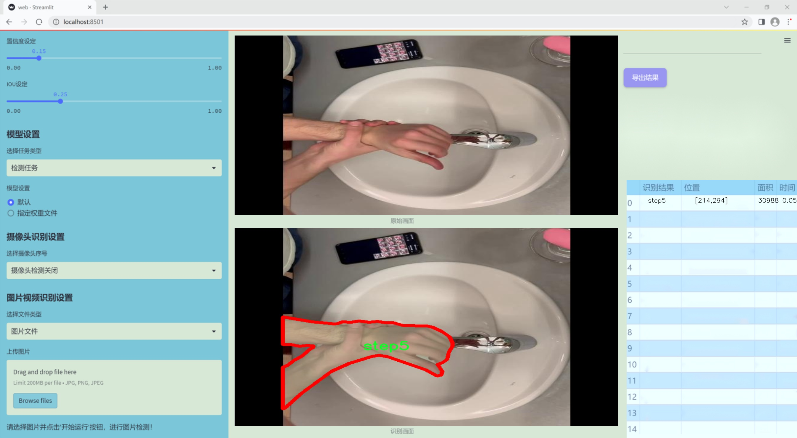

### 1.背景意义

研究背景与意义

随着公共卫生意识的提高，正确的洗手步骤已被广泛认可为预防传染病传播的重要措施。尤其是在新冠疫情期间，洗手的正确性和频率成为了人们日常生活中的重要环节。然而，尽管人们普遍了解洗手的重要性，实际操作中仍存在着步骤不规范、时间不足等问题。因此，开发一个能够实时识别和指导正确洗手步骤的系统，具有重要的现实意义。

本研究旨在基于改进的YOLOv11模型，构建一个高效的图像分割系统，以准确识别洗手过程中的五个关键步骤。这五个步骤分别为：步骤一（润湿双手）、步骤二（涂抹肥皂）、步骤三（搓洗手掌）、步骤四（冲洗双手）、步骤五（擦干双手）。通过对这些步骤的精准识别，系统不仅能够帮助用户了解和掌握正确的洗手方法，还能在公共场所或医疗机构中，提供实时的指导，降低交叉感染的风险。

为实现这一目标，本研究使用了一个包含6552张图像的数据集，数据集经过精心标注，确保每个洗手步骤的准确性。通过对图像进行预处理和增强，系统能够在不同的环境和条件下保持良好的识别性能。此外，YOLOv11模型的改进版本在速度和准确性上均有显著提升，使得实时监测和反馈成为可能。

总之，基于改进YOLOv11的正确洗手步骤识别图像分割系统，不仅能够提升公众对洗手重要性的认识，还能在实际应用中提供有效的指导，从而在预防疾病传播方面发挥积极作用。这一研究的开展，既是对计算机视觉技术在公共卫生领域应用的探索，也是对人们健康行为改善的有力推动。

### 2.视频效果

[2.1 视频效果](https://www.bilibili.com/video/BV1aXSMYVEgD/)

### 3.图片效果




##### [项目涉及的源码数据来源链接](https://kdocs.cn/l/cszuIiCKVNis)**

注意：本项目提供训练的数据集和训练教程,由于版本持续更新,暂不提供权重文件（best.pt）,请按照6.训练教程进行训练后实现上图演示的效果。

### 4.数据集信息

##### 4.1 本项目数据集类别数＆类别名

nc: 5
names: ['step1', 'step2', 'step3', 'step4', 'step5']


该项目为【图像分割】数据集，请在【训练教程和Web端加载模型教程（第三步）】这一步的时候按照【图像分割】部分的教程来训练

##### 4.2 本项目数据集信息介绍

本项目数据集信息介绍

本项目所使用的数据集名为“SOP_V2”，旨在为改进YOLOv11的正确洗手步骤识别图像分割系统提供支持。该数据集包含五个主要类别，分别为“step1”、“step2”、“step3”、“step4”和“step5”，每个类别对应洗手过程中的一个具体步骤。这五个步骤构成了一个完整的洗手流程，涵盖了从开始洗手到完成洗手的每一个环节，确保用户能够遵循标准操作程序（SOP）进行正确的洗手。

数据集中的图像经过精心挑选和标注，确保每个步骤的特征都能够被清晰地识别和分割。通过对每个步骤的详细标注，数据集为模型训练提供了丰富的样本，使得YOLOv11能够有效地学习和识别不同的洗手步骤。数据集的多样性体现在不同的背景、光照条件以及手部动作的变化上，这些因素将帮助模型在实际应用中具备更强的鲁棒性和适应性。

此外，数据集的构建还考虑到了实际使用场景中的各种可能性，例如不同年龄段和性别的用户在洗手时的表现差异。这种多样性不仅提高了模型的泛化能力，也使得其在真实环境中的应用效果更加理想。通过使用“SOP_V2”数据集，改进后的YOLOv11系统将能够更准确地识别和分割出洗手过程中的每一个步骤，从而有效提升洗手教育和健康宣传的效果，为公共卫生安全做出贡献。


### 5.全套项目环境部署视频教程（零基础手把手教学）

[5.1 所需软件PyCharm和Anaconda安装教程（第一步）](https://www.bilibili.com/video/BV1BoC1YCEKi/?spm_id_from=333.999.0.0&vd_source=bc9aec86d164b67a7004b996143742dc)


[5.2 安装Python虚拟环境创建和依赖库安装视频教程（第二步）](https://www.bilibili.com/video/BV1ZoC1YCEBw?spm_id_from=333.788.videopod.sections&vd_source=bc9aec86d164b67a7004b996143742dc)

### 6.改进YOLOv11训练教程和Web_UI前端加载模型教程（零基础手把手教学）

[6.1 改进YOLOv11训练教程和Web_UI前端加载模型教程（第三步）](https://www.bilibili.com/video/BV1BoC1YCEhR?spm_id_from=333.788.videopod.sections&vd_source=bc9aec86d164b67a7004b996143742dc)


按照上面的训练视频教程链接加载项目提供的数据集，运行train.py即可开始训练



     Epoch   gpu_mem       box       obj       cls    labels  img_size
     1/200     20.8G   0.01576   0.01955  0.007536        22      1280: 100%|██████████| 849/849 [14:42<00:00,  1.04s/it]
               Class     Images     Labels          P          R     mAP@.5 mAP@.5:.95: 100%|██████████| 213/213 [01:14<00:00,  2.87it/s]
                 all       3395      17314      0.994      0.957      0.0957      0.0843

     Epoch   gpu_mem       box       obj       cls    labels  img_size
     2/200     20.8G   0.01578   0.01923  0.007006        22      1280: 100%|██████████| 849/849 [14:44<00:00,  1.04s/it]
               Class     Images     Labels          P          R     mAP@.5 mAP@.5:.95: 100%|██████████| 213/213 [01:12<00:00,  2.95it/s]
                 all       3395      17314      0.996      0.956      0.0957      0.0845

     Epoch   gpu_mem       box       obj       cls    labels  img_size
     3/200     20.8G   0.01561    0.0191  0.006895        27      1280: 100%|██████████| 849/849 [10:56<00:00,  1.29it/s]
               Class     Images     Labels          P          R     mAP@.5 mAP@.5:.95: 100%|███████   | 187/213 [00:52<00:00,  4.04it/s]
                 all       3395      17314      0.996      0.957      0.0957      0.0845


###### [项目数据集下载链接](https://kdocs.cn/l/cszuIiCKVNis)

### 7.原始YOLOv11算法讲解


ultralytics发布了最新的作品YOLOv11，这一次YOLOv11的变化相对于ultralytics公司的上一代作品YOLOv8变化不是很大的（YOLOv9、YOLOv10均不是ultralytics公司作品），其中改变的位置涉及到C2f变为C3K2，在SPPF后面加了一层类似于注意力机制的C2PSA，还有一个变化大家从yaml文件是看不出来的就是它的检测头内部替换了两个DWConv，以及模型的深度和宽度参数进行了大幅度调整，但是在损失函数方面就没有变化还是采用的CIoU作为边界框回归损失，下面带大家深入理解一下ultralytics最新作品YOLOv11的创新点。

**下图为最近的YOLO系列发布时间线！**


* * *

###### YOLOv11和YOLOv8对比

在YOLOYOLOv5，YOLOv8，和YOLOv11是ultralytics公司作品（ultralytics出品必属精品），下面用一张图片从yaml文件来带大家对比一下YOLOv8和YOLOv11的区别，配置文件变得内容比较少大家可以看一卡，左侧为YOLOv8右侧为YOLOv11，不同的点我用黑线标注了出来。


* * *

###### YOLOv11的网络结构解析

下面的图片为YOLOv11的网络结构图。


**其中主要创新点可以总结如下- > **

* * *

1\.
提出C3k2机制，其中C3k2有参数为c3k，其中在网络的浅层c3k设置为False（下图中可以看到c3k2第二个参数被设置为False，就是对应的c3k参数）。


此时所谓的C3k2就相当于YOLOv8中的C2f，其网络结构为一致的，其中的C3k机制的网络结构图如下图所示
**（为什么叫C3k2，我个人理解是因为C3k的调用时C3k其中的参数N固定设置为2的原因，个人理解不一定对** ）。


* * *

2\.
第二个创新点是提出C2PSA机制，这是一个C2（C2f的前身）机制内部嵌入了一个多头注意力机制，在这个过程中我还发现作者尝试了C2fPSA机制但是估计效果不如C2PSA，有的时候机制有没有效果理论上真的很难解释通，下图为C2PSA机制的原理图，仔细观察把Attention哪里去掉则C2PSA机制就变为了C2所以我上面说C2PSA就是C2里面嵌入了一个PSA机制。


* * *

3\.
第三个创新点可以说是原先的解耦头中的分类检测头增加了两个DWConv，具体的对比大家可以看下面两个图下面的是YOLOv11的解耦头，上面的是YOLOv8的解耦头.


我们上面看到了在分类检测头中YOLOv11插入了两个DWConv这样的做法可以大幅度减少参数量和计算量（原先两个普通的Conv大家要注意到卷积和是由3变为了1的，这是形成了两个深度可分离Conv），大家可能不太理解为什么加入了两个DWConv还能够减少计算量，以及什么是深度可分离Conv，下面我来解释一下。

> **`DWConv` 代表 Depthwise
> Convolution（深度卷积）**，是一种在卷积神经网络中常用的高效卷积操作。它主要用于减少计算复杂度和参数量，尤其在移动端或轻量化网络（如
> MobileNet）中十分常见。
>
> **1\. 标准卷积的计算过程**
>
> 在标准卷积操作中，对于一个输入张量（通常是一个多通道的特征图），卷积核的尺寸是 `(h, w, C_in)`，其中 `h` 和 `w`
> 是卷积核的空间尺寸，`C_in`
> 是输入通道的数量。而卷积核与输入张量做的是完整的卷积运算，每个输出通道都与所有输入通道相连并参与卷积操作，导致计算量比较大。
>
> 标准卷积的计算过程是这样的：
>
>   * 每个输出通道是所有输入通道的组合（加权求和），卷积核在每个位置都会计算与所有输入通道的点积。
>   * 假设有 `C_in` 个输入通道和 `C_out` 个输出通道，那么卷积核的总参数量是 `C_in * C_out * h * w`。
>

>
> 2\. **Depthwise Convolution（DWConv）**
>
> 与标准卷积不同， **深度卷积** 将输入的每个通道单独处理，即 **每个通道都有自己的卷积核进行卷积**
> ，不与其他通道进行交互。它可以被看作是标准卷积的一部分，专注于空间维度上的卷积运算。
>
> **深度卷积的计算过程：**
>
>   * 假设输入张量有 `C_in` 个通道，每个通道会使用一个 `h × w`
> 的卷积核进行卷积操作。这个过程称为“深度卷积”，因为每个通道独立进行卷积运算。
>   * 输出的通道数与输入通道数一致，每个输出通道只和对应的输入通道进行卷积，没有跨通道的组合。
>   * 参数量和计算量相比标准卷积大大减少，卷积核的参数量是 `C_in * h * w`。
>

>
> **深度卷积的优点：**
>
>   1. **计算效率高** ：相对于标准卷积，深度卷积显著减少了计算量。它只处理空间维度上的卷积，不再处理通道间的卷积。
>   2.  **参数量减少** ：由于每个卷积核只对单个通道进行卷积，参数量大幅减少。例如，标准卷积的参数量为 `C_in * C_out * h *
> w`，而深度卷积的参数量为 `C_in * h * w`。
>   3.  **结合点卷积可提升效果** ：为了弥补深度卷积缺乏跨通道信息整合的问题，通常深度卷积后会配合 `1x1` 的点卷积（Pointwise
> Convolution）使用，通过 `1x1` 的卷积核整合跨通道的信息。这种组合被称为 **深度可分离卷积** （Depthwise
> Separable Convolution） | **这也是我们本文YOLOv11中的做法** 。
>

>
> 3\. **深度卷积与标准卷积的区别**
>
> 操作类型| 卷积核大小| 输入通道数| 输出通道数| 参数量  
> ---|---|---|---|---  
> 标准卷积| `h × w`| `C_in`| `C_out`| `C_in * C_out * h * w`  
> 深度卷积（DWConv）| `h × w`| `C_in`| `C_in`| `C_in * h * w`  
>  
> 可以看出，深度卷积在相同的卷积核大小下，参数量减少了约 `C_out` 倍
> （细心的人可以发现用最新版本的ultralytics仓库运行YOLOv8参数量相比于之前的YOLOv8以及大幅度减少了这就是因为检测头改了的原因但是名字还是Detect，所以如果你想继续用YOLOv8发表论文做实验那么不要更新最近的ultralytics仓库）。
>
> **4\. 深度可分离卷积 (Depthwise Separable Convolution)**
>
> 深度卷积常与 `1x1` 的点卷积配合使用，这称为深度可分离卷积。其过程如下：
>
>   1. 先对输入张量进行深度卷积，对每个通道独立进行空间卷积。
>   2. 然后通过 `1x1` 点卷积，对通道维度进行混合，整合不同通道的信息。
>

>
> 这样既可以保证计算量的减少，又可以保持跨通道的信息流动。
>
> 5\. **总结**
>
> `DWConv` 是一种高效的卷积方式，通过单独处理每个通道来减少计算量，结合 `1x1`
> 的点卷积，形成深度可分离卷积，可以在保持网络性能的同时极大地减少模型的计算复杂度和参数量。

**看到这里大家应该明白了为什么加入了两个DWConv还能减少参数量以及YOLOv11的检测头创新点在哪里。**

* * *

##### YOLOv11和YOLOv8还有一个不同的点就是其各个版本的模型（N - S - M- L - X）网络深度和宽度变了


可以看到在深度（depth）和宽度
（width）两个地方YOLOv8和YOLOv11是基本上完全不同了，这里我理解这么做的含义就是模型网络变小了，所以需要加深一些模型的放缩倍数来弥补模型之前丧失的能力从而来达到一个平衡。

> **本章总结：**
> YOLOv11的改进点其实并不多更多的都是一些小的结构上的创新，相对于之前的YOLOv5到YOLOv8的创新，其实YOLOv11的创新点不算多，但是其是ultralytics公司的出品，同时ultralytics仓库的使用量是非常多的（不像YOLOv9和YOLOv10）所以在未来的很长一段时间内其实YOLO系列估计不会再更新了，YOLOv11作为最新的SOTA肯定是十分适合大家来发表论文和创新的。
>

### 8.200+种全套改进YOLOV11创新点原理讲解

#### 8.1 200+种全套改进YOLOV11创新点原理讲解大全

由于篇幅限制，每个创新点的具体原理讲解就不全部展开，具体见下列网址中的改进模块对应项目的技术原理博客网址【Blog】（创新点均为模块化搭建，原理适配YOLOv5~YOLOv11等各种版本）

[改进模块技术原理博客【Blog】网址链接](https://gitee.com/qunmasj/good)


#### 8.2 精选部分改进YOLOV11创新点原理讲解

###### 这里节选部分改进创新点展开原理讲解(完整的改进原理见上图和[改进模块技术原理博客链接](https://gitee.com/qunmasj/good)【如果此小节的图加载失败可以通过CSDN或者Github搜索该博客的标题访问原始博客，原始博客图片显示正常】

### 动态蛇形卷积Dynamic Snake Convolution

参考论文： 2307.08388.pdf (arxiv.org)

血管、道路等拓扑管状结构的精确分割在各个领域都至关重要，确保下游任务的准确性和效率。 然而，许多因素使任务变得复杂，包括薄的局部结构和可变的全局形态。在这项工作中，我们注意到管状结构的特殊性，并利用这些知识来指导我们的 DSCNet 在三个阶段同时增强感知：特征提取、特征融合、 和损失约束。 首先，我们提出了一种动态蛇卷积，通过自适应地关注细长和曲折的局部结构来准确捕获管状结构的特征。 随后，我们提出了一种多视图特征融合策略，以补充特征融合过程中多角度对特征的关注，确保保留来自不同全局形态的重要信息。 最后，提出了一种基于持久同源性的连续性约束损失函数，以更好地约束分割的拓扑连续性。 2D 和 3D 数据集上的实验表明，与多种方法相比，我们的 DSCNet 在管状结构分割任务上提供了更好的准确性和连续性。 我们的代码是公开的。 
主要的挑战源于细长微弱的局部结构特征与复杂多变的全局形态特征。本文关注到管状结构细长连续的特点，并利用这一信息在神经网络以下三个阶段同时增强感知：特征提取、特征融合和损失约束。分别设计了动态蛇形卷积（Dynamic Snake Convolution），多视角特征融合策略与连续性拓扑约束损失。 

我们希望卷积核一方面能够自由地贴合结构学习特征，另一方面能够在约束条件下不偏离目标结构太远。在观察管状结构的细长连续的特征后，脑海里想到了一个动物——蛇。我们希望卷积核能够像蛇一样动态地扭动，来贴合目标的结构。

我们希望卷积核一方面能够自由地贴合结构学习特征，另一方面能够在约束条件下不偏离目标结构太远。在观察管状结构的细长连续的特征后，脑海里想到了一个动物——蛇。我们希望卷积核能够像蛇一样动态地扭动，来贴合目标的结构。


### DCNV2融入YOLOv11
DCN和DCNv2（可变性卷积）
网上关于两篇文章的详细描述已经很多了，我这里具体的细节就不多讲了，只说一下其中实现起来比较困惑的点。（黑体字会讲解）

DCNv1解决的问题就是我们常规的图像增强，仿射变换（线性变换加平移）不能解决的多种形式目标变换的几何变换的问题。如下图所示。

可变性卷积的思想很简单，就是讲原来固定形状的卷积核变成可变的。如下图所示：


首先来看普通卷积，以3x3卷积为例对于每个输出y(p0)，都要从x上采样9个位置，这9个位置都在中心位置x(p0)向四周扩散得到的gird形状上，(-1,-1)代表x(p0)的左上角，(1,1)代表x(p0)的右下角，其他类似。

用公式表示如下：


可变性卷积Deformable Conv操作并没有改变卷积的计算操作，而是在卷积操作的作用区域上，加入了一个可学习的参数∆pn。同样对于每个输出y(p0)，都要从x上采样9个位置，这9个位置是中心位置x(p0)向四周扩散得到的，但是多了 ∆pn，允许采样点扩散成非gird形状。


偏移量是通过对原始特征层进行卷积得到的。比如输入特征层是w×h×c，先对输入的特征层进行卷积操作，得到w×h×2c的offset field。这里的w和h和原始特征层的w和h是一致的，offset field里面的值是输入特征层对应位置的偏移量，偏移量有x和y两个方向，所以offset field的channel数是2c。offset field里的偏移量是卷积得到的，可能是浮点数，所以接下来需要通过双向性插值计算偏移位置的特征值。在偏移量的学习中，梯度是通过双线性插值来进行反向传播的。
看到这里是不是还是有点迷茫呢？那到底程序上面怎么实现呢？


事实上由上面的公式我们可以看得出来∆pn这个偏移量是加在原像素点上的，但是我们怎么样从代码上对原像素点加这个量呢？其实很简单，就是用一个普通的卷积核去跟输入图片（一般是输入的feature_map）卷积就可以了卷积核的数量是2N也就是23*3==18（前9个通道是x方向的偏移量，后9个是y方向的偏移量），然后把这个卷积的结果与正常卷积的结果进行相加就可以了。
然后又有了第二个问题，怎么样反向传播呢？为什么会有这个问题呢？因为求出来的偏移量+正常卷积输出的结果往往是一个浮点数，浮点数是无法对应到原图的像素点的，所以自然就想到了双线性差值的方法求出浮点数对应的浮点像素点。


#### DCN v2
对于positive的样本来说，采样的特征应该focus在RoI内，如果特征中包含了过多超出RoI的内容，那么结果会受到影响和干扰。而negative样本则恰恰相反，引入一些超出RoI的特征有助于帮助网络判别这个区域是背景区域。

DCNv1引入了可变形卷积，能更好的适应目标的几何变换。但是v1可视化结果显示其感受野对应位置超出了目标范围，导致特征不受图像内容影响（理想情况是所有的对应位置分布在目标范围以内）。

为了解决该问题：提出v2, 主要有

1、扩展可变形卷积，增强建模能力
2、提出了特征模拟方案指导网络培训：feature mimicking scheme

上面这段话是什么意思呢，通俗来讲就是，我们的可变性卷积的区域大于目标所在区域，所以这时候就会对非目标区域进行错误识别。

所以自然能想到的解决方案就是加入权重项进行惩罚。（至于这个实现起来就比较简单了，直接初始化一个权重然后乘(input+offsets)就可以了）


可调节的RoIpooling也是类似的，公式如下：


### 9.系统功能展示

图9.1.系统支持检测结果表格显示

  图9.2.系统支持置信度和IOU阈值手动调节

  图9.3.系统支持自定义加载权重文件best.pt(需要你通过步骤5中训练获得)

  图9.4.系统支持摄像头实时识别

  图9.5.系统支持图片识别

  图9.6.系统支持视频识别

  图9.7.系统支持识别结果文件自动保存

  图9.8.系统支持Excel导出检测结果数据


### 10. YOLOv11核心改进源码讲解

#### 10.1 attention.py

以下是经过简化和注释的核心代码，保留了主要的类和方法，去掉了冗余部分，并对每个重要部分进行了详细的中文注释。

```python
import torch
from torch import nn
import torch.nn.functional as F

class EMA(nn.Module):
    """ 
    Exponential Moving Average (EMA) Module
    用于计算输入特征的指数移动平均，增强特征表达能力。
    """
    def __init__(self, channels, factor=8):
        super(EMA, self).__init__()
        self.groups = factor
        assert channels // self.groups > 0
        self.softmax = nn.Softmax(-1)
        self.agp = nn.AdaptiveAvgPool2d((1, 1))
        self.pool_h = nn.AdaptiveAvgPool2d((None, 1))
        self.pool_w = nn.AdaptiveAvgPool2d((1, None))
        self.gn = nn.GroupNorm(channels // self.groups, channels // self.groups)
        self.conv1x1 = nn.Conv2d(channels // self.groups, channels // self.groups, kernel_size=1)
        self.conv3x3 = nn.Conv2d(channels // self.groups, channels // self.groups, kernel_size=3, padding=1)

    def forward(self, x):
        b, c, h, w = x.size()
        group_x = x.reshape(b * self.groups, -1, h, w)  # 将输入特征分组
        x_h = self.pool_h(group_x)  # 对每组进行水平池化
        x_w = self.pool_w(group_x).permute(0, 1, 3, 2)  # 对每组进行垂直池化并转置
        hw = self.conv1x1(torch.cat([x_h, x_w], dim=2))  # 1x1卷积处理
        x_h, x_w = torch.split(hw, [h, w], dim=2)  # 分离回原来的尺寸
        x1 = self.gn(group_x * x_h.sigmoid() * x_w.permute(0, 1, 3, 2).sigmoid())  # 归一化
        x2 = self.conv3x3(group_x)  # 3x3卷积处理
        x11 = self.softmax(self.agp(x1).reshape(b * self.groups, -1, 1).permute(0, 2, 1))  # 计算softmax权重
        x12 = x2.reshape(b * self.groups, c // self.groups, -1)  # 变形为适合计算的形状
        x21 = self.softmax(self.agp(x2).reshape(b * self.groups, -1, 1).permute(0, 2, 1))  # 计算softmax权重
        x22 = x1.reshape(b * self.groups, c // self.groups, -1)  # 变形为适合计算的形状
        weights = (torch.matmul(x11, x12) + torch.matmul(x21, x22)).reshape(b * self.groups, 1, h, w)  # 计算最终权重
        return (group_x * weights.sigmoid()).reshape(b, c, h, w)  # 返回加权后的特征

class SimAM(nn.Module):
    """ 
    SimAM (Similarity Attention Module)
    通过计算输入特征的相似性来增强特征表达。
    """
    def __init__(self, e_lambda=1e-4):
        super(SimAM, self).__init__()
        self.activaton = nn.Sigmoid()  # 激活函数
        self.e_lambda = e_lambda  # 正则化参数

    def forward(self, x):
        b, c, h, w = x.size()
        n = w * h - 1  # 计算总的像素点数

        # 计算输入特征的均值平方差
        x_minus_mu_square = (x - x.mean(dim=[2, 3], keepdim=True)).pow(2)
        y = x_minus_mu_square / (4 * (x_minus_mu_square.sum(dim=[2, 3], keepdim=True) / n + self.e_lambda)) + 0.5  # 计算相似性

        return x * self.activaton(y)  # 返回加权后的特征

class SpatialGroupEnhance(nn.Module):
    """ 
    Spatial Group Enhance Module
    通过空间增强机制提升特征表达能力。
    """
    def __init__(self, groups=8):
        super().__init__()
        self.groups = groups
        self.avg_pool = nn.AdaptiveAvgPool2d(1)  # 自适应平均池化
        self.weight = nn.Parameter(torch.zeros(1, groups, 1, 1))  # 权重参数
        self.bias = nn.Parameter(torch.zeros(1, groups, 1, 1))  # 偏置参数
        self.sig = nn.Sigmoid()  # 激活函数
        self.init_weights()  # 初始化权重

    def init_weights(self):
        for m in self.modules():
            if isinstance(m, nn.Conv2d):
                nn.init.kaiming_normal_(m.weight, mode='fan_out')  # Kaiming初始化
                if m.bias is not None:
                    nn.init.constant_(m.bias, 0)  # 偏置初始化为0

    def forward(self, x):
        b, c, h, w = x.shape
        x = x.view(b * self.groups, -1, h, w)  # 变形为分组形式
        xn = x * self.avg_pool(x)  # 计算增强特征
        xn = xn.sum(dim=1, keepdim=True)  # 求和
        t = xn.view(b * self.groups, -1)  # 变形为适合计算的形状

        t = t - t.mean(dim=1, keepdim=True)  # 去均值
        std = t.std(dim=1, keepdim=True) + 1e-5  # 计算标准差
        t = t / std  # 标准化
        t = t.view(b, self.groups, h, w)  # 变形为原始形状

        t = t * self.weight + self.bias  # 计算最终权重
        t = t.view(b * self.groups, 1, h, w)  # 变形为适合计算的形状
        x = x * self.sig(t)  # 加权输入特征
        return x.view(b, c, h, w)  # 返回加权后的特征

# 其他模块如 TopkRouting, KVGather, QKVLinear, BiLevelRoutingAttention 等可以根据需要进行类似的处理
```

以上代码保留了核心的功能模块，并为每个模块添加了详细的中文注释，便于理解其作用和实现逻辑。

这个文件`attention.py`包含了多种注意力机制的实现，主要用于深度学习模型中的特征提取和增强。文件中定义了多个类，每个类实现了一种特定的注意力机制或相关功能。以下是对文件中主要部分的逐一分析：

首先，文件导入了必要的库，包括`torch`、`torch.nn`、`torchvision`等，这些库为构建和训练深度学习模型提供了基础工具。

接下来，定义了一系列注意力机制的类。比如，`EMA`类实现了一种基于通道的注意力机制，使用了自适应平均池化和卷积操作来增强特征。它通过对输入特征进行分组处理，计算每个组的加权和，从而提升特征的表达能力。

`SimAM`类实现了一种简单的注意力机制，通过计算输入特征的均值和方差来生成注意力权重，并使用Sigmoid激活函数进行归一化。这个机制可以帮助模型更好地关注重要特征。

`SpatialGroupEnhance`类则实现了一种空间增强机制，利用自适应平均池化和卷积操作来提取空间特征，并通过Sigmoid函数生成注意力权重，从而对输入特征进行加权。

`TopkRouting`类实现了一种可微分的Top-k路由机制，允许模型在处理特征时选择最重要的k个特征，从而提升模型的性能。

`KVGather`类则用于根据路由索引和权重从键值对中选择特征，支持不同的加权方式（软加权或硬加权）。

`BiLevelRoutingAttention`类实现了一种双层路由注意力机制，结合了局部和全局特征，通过对输入特征进行分块处理，计算注意力权重并生成输出特征。

`CoordAtt`类实现了一种坐标注意力机制，通过对输入特征进行空间池化和卷积操作，生成用于增强特征的权重。

`TripletAttention`类实现了一种三元注意力机制，通过对输入特征进行不同方向的注意力计算，结合多个注意力输出，提升特征表达能力。

`BAMBlock`类结合了通道注意力和空间注意力，增强了特征的表达能力。

`EfficientAttention`类实现了一种高效的注意力机制，结合了多种卷积操作和注意力计算，提升了模型的性能。

`DAttention`类实现了一种变形卷积注意力机制，允许模型在处理特征时动态调整卷积核的位置，从而提升特征提取的灵活性。

`MLCA`和`MPCA`类实现了多路径和多通道注意力机制，通过不同的卷积操作和注意力计算，增强了特征的表达能力。

最后，文件中还定义了一些辅助类，如`Mix`、`LayerNormProxy`等，用于实现特定的功能，如特征混合和层归一化。

总体而言，这个文件提供了多种先进的注意力机制实现，适用于各种深度学习任务，尤其是在计算机视觉领域。通过这些注意力机制，模型能够更好地关注重要特征，提高性能和效果。

#### 10.2 kagn_conv.py

以下是经过简化并添加详细中文注释的核心代码部分：

```python
import torch
import torch.nn as nn
from functools import lru_cache

class KAGNConvNDLayer(nn.Module):
    def __init__(self, conv_class, norm_class, conv_w_fun, input_dim, output_dim, degree, kernel_size,
                 groups=1, padding=0, stride=1, dilation=1, dropout: float = 0.0, ndim: int = 2):
        super(KAGNConvNDLayer, self).__init__()
        
        # 初始化参数
        self.inputdim = input_dim  # 输入维度
        self.outdim = output_dim    # 输出维度
        self.degree = degree         # 多项式的度数
        self.kernel_size = kernel_size  # 卷积核大小
        self.padding = padding       # 填充
        self.stride = stride         # 步幅
        self.dilation = dilation     # 膨胀
        self.groups = groups         # 分组卷积的组数
        self.base_activation = nn.SiLU()  # 基础激活函数
        self.conv_w_fun = conv_w_fun  # 卷积权重函数
        self.ndim = ndim             # 数据的维度
        self.dropout = None          # Dropout层

        # 根据维度选择合适的Dropout层
        if dropout > 0:
            if ndim == 1:
                self.dropout = nn.Dropout1d(p=dropout)
            elif ndim == 2:
                self.dropout = nn.Dropout2d(p=dropout)
            elif ndim == 3:
                self.dropout = nn.Dropout3d(p=dropout)

        # 检查分组参数的有效性
        if groups <= 0:
            raise ValueError('groups must be a positive integer')
        if input_dim % groups != 0:
            raise ValueError('input_dim must be divisible by groups')
        if output_dim % groups != 0:
            raise ValueError('output_dim must be divisible by groups')

        # 创建基础卷积层和归一化层
        self.base_conv = nn.ModuleList([conv_class(input_dim // groups,
                                                   output_dim // groups,
                                                   kernel_size,
                                                   stride,
                                                   padding,
                                                   dilation,
                                                   groups=1,
                                                   bias=False) for _ in range(groups)])

        self.layer_norm = nn.ModuleList([norm_class(output_dim // groups) for _ in range(groups)])

        # 初始化多项式权重
        poly_shape = (groups, output_dim // groups, (input_dim // groups) * (degree + 1)) + tuple(
            kernel_size for _ in range(ndim))
        self.poly_weights = nn.Parameter(torch.randn(*poly_shape))  # 多项式权重
        self.beta_weights = nn.Parameter(torch.zeros(degree + 1, dtype=torch.float32))  # beta权重

        # 使用Kaiming均匀分布初始化卷积层权重
        for conv_layer in self.base_conv:
            nn.init.kaiming_uniform_(conv_layer.weight, nonlinearity='linear')

        nn.init.kaiming_uniform_(self.poly_weights, nonlinearity='linear')
        nn.init.normal_(
            self.beta_weights,
            mean=0.0,
            std=1.0 / ((kernel_size ** ndim) * self.inputdim * (self.degree + 1.0)),
        )

    def beta(self, n, m):
        # 计算beta值
        return (
            ((m + n) * (m - n) * n ** 2) / (m ** 2 / (4.0 * n ** 2 - 1.0))
        ) * self.beta_weights[n]

    @lru_cache(maxsize=128)  # 使用缓存避免重复计算
    def gram_poly(self, x, degree):
        # 计算Legendre多项式
        p0 = x.new_ones(x.size())  # p0初始化为1

        if degree == 0:
            return p0.unsqueeze(-1)

        p1 = x
        grams_basis = [p0, p1]

        for i in range(2, degree + 1):
            p2 = x * p1 - self.beta(i - 1, i) * p0  # 递归计算
            grams_basis.append(p2)
            p0, p1 = p1, p2

        return torch.cat(grams_basis, dim=1)  # 合并多项式基

    def forward_kag(self, x, group_index):
        # 前向传播，处理每个组的输入
        basis = self.base_conv[group_index](self.base_activation(x))  # 基础卷积

        # 将输入归一化到[-1, 1]范围
        x = torch.tanh(x).contiguous()

        if self.dropout is not None:
            x = self.dropout(x)  # 应用Dropout

        grams_basis = self.base_activation(self.gram_poly(x, self.degree))  # 计算Gram多项式基
        y = self.conv_w_fun(grams_basis, self.poly_weights[group_index],
                            stride=self.stride, dilation=self.dilation,
                            padding=self.padding, groups=1)  # 卷积操作

        y = self.base_activation(self.layer_norm[group_index](y + basis))  # 归一化和激活

        return y

    def forward(self, x):
        # 前向传播，处理所有组的输入
        split_x = torch.split(x, self.inputdim // self.groups, dim=1)  # 按组分割输入
        output = []
        for group_ind, _x in enumerate(split_x):
            y = self.forward_kag(_x.clone(), group_ind)  # 处理每个组
            output.append(y.clone())
        y = torch.cat(output, dim=1)  # 合并输出
        return y
```

### 代码说明：
1. **KAGNConvNDLayer**：这是一个自定义的卷积层，支持多维卷积（1D、2D、3D）。它使用了Legendre多项式和分组卷积的思想。
2. **参数初始化**：在构造函数中，初始化了卷积层、归一化层以及多项式权重。使用Kaiming均匀分布初始化卷积层的权重以促进训练。
3. **beta函数**：计算与多项式相关的beta值。
4. **gram_poly函数**：计算Legendre多项式的基，使用缓存以提高效率。
5. **forward_kag函数**：实现了前向传播逻辑，处理每个组的输入。
6. **forward函数**：实现了整体的前向传播，处理所有组的输入并合并输出。

这个程序文件定义了一个名为 `kagn_conv.py` 的模块，主要实现了一个自定义的卷积层 `KAGNConvNDLayer`，以及其在不同维度（1D、2D、3D）上的特化版本。这个模块的设计灵感来源于某个开源项目，具体的实现方式和结构都相对复杂，下面是对代码的详细讲解。

首先，程序导入了必要的库，包括 `torch` 和 `torch.nn`，并从 `torch.nn.functional` 中导入了不同维度的卷积函数。接着，定义了一个名为 `KAGNConvNDLayer` 的类，继承自 `nn.Module`，这是所有 PyTorch 模块的基类。

在 `__init__` 方法中，类的构造函数接受多个参数，包括卷积类型、归一化类型、输入和输出维度、卷积核大小、分组数、填充、步幅、扩张、丢弃率和维度数等。构造函数中首先初始化了一些属性，并根据传入的参数设置了基础激活函数（使用了 SiLU 激活函数）。接着，程序检查了分组数和输入输出维度的有效性。

然后，构造函数创建了基础卷积层和归一化层的模块列表，分别用于不同的分组。接下来，程序定义了多项式权重和 beta 权重，并使用 Kaiming 均匀分布初始化这些权重，以确保训练的起始状态良好。

`beta` 方法用于计算 beta 权重，`gram_poly` 方法用于计算勒让德多项式，这些多项式在卷积操作中起到重要作用。`forward_kag` 方法是核心的前向传播函数，它首先对输入进行基础激活，然后通过基础卷积层进行线性变换。接着，输入被归一化到 [-1, 1] 的范围，以便进行稳定的勒让德多项式计算。最后，计算得到的多项式基与多项式权重进行卷积操作，并通过归一化层和激活函数得到最终输出。

`forward` 方法负责处理输入数据，将其分成多个组，并对每个组调用 `forward_kag` 方法进行处理，最后将所有组的输出拼接在一起返回。

接下来，程序定义了三个特化类 `KAGNConv3DLayer`、`KAGNConv2DLayer` 和 `KAGNConv1DLayer`，分别对应三维、二维和一维卷积。这些类通过调用父类 `KAGNConvNDLayer` 的构造函数，传入相应的卷积和归一化类型，简化了多维卷积层的实现。

总体而言，这个程序文件实现了一个灵活且功能强大的卷积层，能够处理不同维度的输入，并结合了多项式特征和归一化方法，适用于复杂的深度学习任务。

#### 10.3 kaln_conv.py

以下是代码中最核心的部分，并附上详细的中文注释：

```python
from functools import lru_cache
import torch
import torch.nn as nn
from torch.nn.functional import conv3d, conv2d, conv1d

class KALNConvNDLayer(nn.Module):
    def __init__(self, conv_class, norm_class, conv_w_fun, input_dim, output_dim, degree, kernel_size,
                 groups=1, padding=0, stride=1, dilation=1, dropout: float = 0.0, ndim: int = 2):
        super(KALNConvNDLayer, self).__init__()
        
        # 初始化参数
        self.inputdim = input_dim  # 输入维度
        self.outdim = output_dim    # 输出维度
        self.degree = degree         # 多项式的阶数
        self.kernel_size = kernel_size  # 卷积核大小
        self.padding = padding       # 填充
        self.stride = stride         # 步幅
        self.dilation = dilation     # 膨胀
        self.groups = groups         # 分组卷积的组数
        self.base_activation = nn.SiLU()  # 基础激活函数
        self.conv_w_fun = conv_w_fun  # 卷积权重函数
        self.ndim = ndim             # 数据的维度（1D, 2D, 3D）
        self.dropout = None          # Dropout层初始化
        
        # 如果dropout大于0，则根据维度选择相应的Dropout层
        if dropout > 0:
            if ndim == 1:
                self.dropout = nn.Dropout1d(p=dropout)
            elif ndim == 2:
                self.dropout = nn.Dropout2d(p=dropout)
            elif ndim == 3:
                self.dropout = nn.Dropout3d(p=dropout)

        # 检查groups参数的有效性
        if groups <= 0:
            raise ValueError('groups must be a positive integer')
        if input_dim % groups != 0:
            raise ValueError('input_dim must be divisible by groups')
        if output_dim % groups != 0:
            raise ValueError('output_dim must be divisible by groups')

        # 创建分组卷积层和归一化层
        self.base_conv = nn.ModuleList([conv_class(input_dim // groups,
                                                   output_dim // groups,
                                                   kernel_size,
                                                   stride,
                                                   padding,
                                                   dilation,
                                                   groups=1,
                                                   bias=False) for _ in range(groups)])

        self.layer_norm = nn.ModuleList([norm_class(output_dim // groups) for _ in range(groups)])

        # 初始化多项式权重
        poly_shape = (groups, output_dim // groups, (input_dim // groups) * (degree + 1)) + tuple(
            kernel_size for _ in range(ndim))
        self.poly_weights = nn.Parameter(torch.randn(*poly_shape))

        # 使用Kaiming均匀分布初始化卷积层权重
        for conv_layer in self.base_conv:
            nn.init.kaiming_uniform_(conv_layer.weight, nonlinearity='linear')
        nn.init.kaiming_uniform_(self.poly_weights, nonlinearity='linear')

    @lru_cache(maxsize=128)  # 使用LRU缓存以避免重复计算勒让德多项式
    def compute_legendre_polynomials(self, x, order):
        # 计算勒让德多项式
        P0 = x.new_ones(x.shape)  # P0 = 1
        if order == 0:
            return P0.unsqueeze(-1)
        P1 = x  # P1 = x
        legendre_polys = [P0, P1]

        # 使用递推关系计算高阶多项式
        for n in range(1, order):
            Pn = ((2.0 * n + 1.0) * x * legendre_polys[-1] - n * legendre_polys[-2]) / (n + 1.0)
            legendre_polys.append(Pn)

        return torch.concatenate(legendre_polys, dim=1)

    def forward_kal(self, x, group_index):
        # 前向传播函数，处理每个分组的输入
        base_output = self.base_conv[group_index](x)  # 基础卷积输出

        # 将输入x归一化到[-1, 1]范围
        x_normalized = 2 * (x - x.min()) / (x.max() - x.min()) - 1 if x.shape[0] > 0 else x

        # 应用Dropout
        if self.dropout is not None:
            x_normalized = self.dropout(x_normalized)

        # 计算勒让德多项式
        legendre_basis = self.compute_legendre_polynomials(x_normalized, self.degree)
        # 使用多项式权重进行线性变换
        poly_output = self.conv_w_fun(legendre_basis, self.poly_weights[group_index],
                                      stride=self.stride, dilation=self.dilation,
                                      padding=self.padding, groups=1)

        # 合并基础输出和多项式输出，进行归一化和激活
        x = base_output + poly_output
        if isinstance(self.layer_norm[group_index], nn.LayerNorm):
            orig_shape = x.shape
            x = self.layer_norm[group_index](x.view(orig_shape[0], -1)).view(orig_shape)
        else:
            x = self.layer_norm[group_index](x)
        x = self.base_activation(x)

        return x

    def forward(self, x):
        # 前向传播，处理所有分组的输入
        split_x = torch.split(x, self.inputdim // self.groups, dim=1)  # 按组分割输入
        output = []
        for group_ind, _x in enumerate(split_x):
            y = self.forward_kal(_x.clone(), group_ind)  # 处理每个分组
            output.append(y.clone())
        y = torch.cat(output, dim=1)  # 合并所有分组的输出
        return y
```

### 代码核心部分说明：
1. **KALNConvNDLayer类**：这是一个自定义的神经网络层，支持多维卷积（1D、2D、3D），结合了勒让德多项式的计算。
2. **初始化方法**：初始化卷积层、归一化层和多项式权重，并进行参数有效性检查。
3. **计算勒让德多项式**：使用递推关系计算勒让德多项式，并使用LRU缓存避免重复计算。
4. **前向传播**：实现了前向传播逻辑，分别处理每个分组的输入，结合基础卷积输出和多项式输出，进行归一化和激活。

这个程序文件定义了一个名为 `KALNConvNDLayer` 的神经网络层，主要用于实现带有多项式特征的卷积操作。该层支持一维、二维和三维卷积，并且通过引入勒让德多项式来增强卷积的表达能力。

在 `KALNConvNDLayer` 的构造函数中，首先定义了一些基本参数，如输入和输出维度、卷积核大小、步幅、填充、扩张、分组数等。构造函数还会根据给定的参数初始化基础卷积层和归一化层，并为多项式权重创建一个可训练的参数。权重的初始化使用了 Kaiming 均匀分布，以便在训练开始时获得更好的性能。

该类的核心功能之一是计算勒让德多项式。通过 `compute_legendre_polynomials` 方法，可以根据输入的归一化值计算出指定阶数的勒让德多项式，并将其存储在一个张量中。这个方法使用了缓存机制，以避免重复计算，提高效率。

在前向传播过程中，`forward_kal` 方法首先对输入进行基础卷积和激活处理，然后对输入进行归一化，并计算勒让德多项式。接着，利用多项式权重进行卷积操作，最后将基础输出和多项式输出相加，并通过归一化和激活函数进行处理。

`forward` 方法则是对输入进行分组处理，并调用 `forward_kal` 方法进行逐组计算，最后将所有组的输出拼接在一起，形成最终的输出。

此外，文件中还定义了三个具体的卷积层类：`KALNConv3DLayer`、`KALNConv2DLayer` 和 `KALNConv1DLayer`，分别对应三维、二维和一维卷积。这些类通过继承 `KALNConvNDLayer`，并在构造函数中指定相应的卷积和归一化层，简化了使用过程。

总体来说，这个程序文件实现了一个灵活且功能强大的卷积层，能够处理不同维度的数据，并通过引入多项式特征来提升模型的表达能力。

#### 10.4 kan_conv.py

以下是代码中最核心的部分，并附上详细的中文注释：

```python
import torch
import torch.nn as nn

class KANConvNDLayer(nn.Module):
    def __init__(self, conv_class, norm_class, input_dim, output_dim, spline_order, kernel_size,
                 groups=1, padding=0, stride=1, dilation=1,
                 ndim: int = 2, grid_size=5, base_activation=nn.GELU, grid_range=[-1, 1], dropout=0.0):
        super(KANConvNDLayer, self).__init__()
        
        # 初始化输入和输出维度、卷积参数等
        self.inputdim = input_dim
        self.outdim = output_dim
        self.spline_order = spline_order
        self.kernel_size = kernel_size
        self.padding = padding
        self.stride = stride
        self.dilation = dilation
        self.groups = groups
        self.ndim = ndim
        self.grid_size = grid_size
        self.base_activation = base_activation()  # 基础激活函数
        self.grid_range = grid_range  # 网格范围

        # 如果设置了dropout，则根据维度选择相应的Dropout层
        self.dropout = None
        if dropout > 0:
            if ndim == 1:
                self.dropout = nn.Dropout1d(p=dropout)
            elif ndim == 2:
                self.dropout = nn.Dropout2d(p=dropout)
            elif ndim == 3:
                self.dropout = nn.Dropout3d(p=dropout)

        # 检查groups参数的有效性
        if groups <= 0:
            raise ValueError('groups must be a positive integer')
        if input_dim % groups != 0:
            raise ValueError('input_dim must be divisible by groups')
        if output_dim % groups != 0:
            raise ValueError('output_dim must be divisible by groups')

        # 创建基础卷积层和样条卷积层
        self.base_conv = nn.ModuleList([conv_class(input_dim // groups,
                                                   output_dim // groups,
                                                   kernel_size,
                                                   stride,
                                                   padding,
                                                   dilation,
                                                   groups=1,
                                                   bias=False) for _ in range(groups)])

        self.spline_conv = nn.ModuleList([conv_class((grid_size + spline_order) * input_dim // groups,
                                                     output_dim // groups,
                                                     kernel_size,
                                                     stride,
                                                     padding,
                                                     dilation,
                                                     groups=1,
                                                     bias=False) for _ in range(groups)])

        # 创建归一化层和激活层
        self.layer_norm = nn.ModuleList([norm_class(output_dim // groups) for _ in range(groups)])
        self.prelus = nn.ModuleList([nn.PReLU() for _ in range(groups)])

        # 初始化网格，用于样条计算
        h = (self.grid_range[1] - self.grid_range[0]) / grid_size
        self.grid = torch.linspace(
            self.grid_range[0] - h * spline_order,
            self.grid_range[1] + h * spline_order,
            grid_size + 2 * spline_order + 1,
            dtype=torch.float32
        )

        # 使用Kaiming均匀分布初始化卷积层的权重
        for conv_layer in self.base_conv:
            nn.init.kaiming_uniform_(conv_layer.weight, nonlinearity='linear')

        for conv_layer in self.spline_conv:
            nn.init.kaiming_uniform_(conv_layer.weight, nonlinearity='linear')

    def forward_kan(self, x, group_index):
        # 对输入应用基础激活函数并进行线性变换
        base_output = self.base_conv[group_index](self.base_activation(x))

        x_uns = x.unsqueeze(-1)  # 扩展维度以进行样条操作
        target = x.shape[1:] + self.grid.shape  # 计算目标形状
        grid = self.grid.view(*list([1 for _ in range(self.ndim + 1)] + [-1, ])).expand(target).contiguous().to(x.device)

        # 计算样条基
        bases = ((x_uns >= grid[..., :-1]) & (x_uns < grid[..., 1:])).to(x.dtype)

        # 计算多阶样条基
        for k in range(1, self.spline_order + 1):
            left_intervals = grid[..., :-(k + 1)]
            right_intervals = grid[..., k:-1]
            delta = torch.where(right_intervals == left_intervals, torch.ones_like(right_intervals),
                                right_intervals - left_intervals)
            bases = ((x_uns - left_intervals) / delta * bases[..., :-1]) + \
                    ((grid[..., k + 1:] - x_uns) / (grid[..., k + 1:] - grid[..., 1:(-k)]) * bases[..., 1:])
        bases = bases.contiguous()
        bases = bases.moveaxis(-1, 2).flatten(1, 2)  # 调整基的形状以适应卷积层
        spline_output = self.spline_conv[group_index](bases)  # 通过样条卷积层计算输出
        x = self.prelus[group_index](self.layer_norm[group_index](base_output + spline_output))  # 归一化和激活

        if self.dropout is not None:
            x = self.dropout(x)  # 应用dropout

        return x

    def forward(self, x):
        # 将输入按组分割
        split_x = torch.split(x, self.inputdim // self.groups, dim=1)
        output = []
        for group_ind, _x in enumerate(split_x):
            y = self.forward_kan(_x.clone(), group_ind)  # 对每个组应用forward_kan
            output.append(y.clone())
        y = torch.cat(output, dim=1)  # 将所有组的输出拼接
        return y
```

### 代码说明：
1. **类定义**：`KANConvNDLayer` 是一个自定义的神经网络层，支持多维卷积（如1D、2D、3D）。
2. **初始化方法**：在构造函数中，初始化输入输出维度、卷积参数、dropout、卷积层、归一化层等。
3. **前向传播**：`forward_kan` 方法实现了样条卷积的前向传播逻辑，计算基础卷积和样条卷积的输出，并应用激活和归一化。
4. **多组处理**：`forward` 方法将输入分成多个组，分别处理每个组的前向传播，最后将结果拼接在一起。

这个程序文件 `kan_conv.py` 定义了一个名为 `KANConvNDLayer` 的神经网络层以及其一维、二维和三维的特定实现。`KANConvNDLayer` 是一个基于卷积的层，结合了样条插值的特性，以便在处理高维数据时能够更好地捕捉复杂的模式。

首先，`KANConvNDLayer` 类的构造函数接受多个参数，包括输入和输出维度、卷积核大小、样条阶数、分组数、填充、步幅、扩张、网格大小、激活函数、网格范围和丢弃率等。这些参数用于初始化卷积层、归一化层和激活函数等组件。构造函数中还包含了一些有效性检查，例如确保分组数为正整数，并且输入和输出维度可以被分组数整除。

在构造函数中，`base_conv` 和 `spline_conv` 是两个卷积层的模块列表，分别用于基本卷积和样条卷积。`layer_norm` 是归一化层的模块列表，`prelus` 是 PReLU 激活函数的模块列表。网格用于样条插值的计算，通过 `torch.linspace` 创建，确保在给定的范围内均匀分布。

`forward_kan` 方法是该层的前向传播逻辑，首先对输入应用基本激活函数，然后进行线性变换。接着，输入被扩展维度以便进行样条操作。通过计算样条基函数，结合输入值和网格，生成样条输出。最终，将基本输出和样条输出相加，经过归一化和激活函数处理后，可能还会应用丢弃层。

`forward` 方法负责处理输入数据，将其分割成多个组，并对每个组调用 `forward_kan` 方法进行处理，最后将所有组的输出拼接在一起。

接下来的三个类 `KANConv3DLayer`、`KANConv2DLayer` 和 `KANConv1DLayer` 继承自 `KANConvNDLayer`，分别为三维、二维和一维卷积层的实现。它们在初始化时指定了对应的卷积和归一化类（`nn.Conv3d`、`nn.Conv2d`、`nn.Conv1d` 和 `nn.InstanceNorm3d`、`nn.InstanceNorm2d`、`nn.InstanceNorm1d`），以便适应不同维度的数据。

总体而言，这个文件实现了一个灵活且强大的卷积层，能够在多维数据上进行有效的特征提取，结合了样条插值的优点，适用于需要处理复杂模式的深度学习任务。

### 11.完整训练+Web前端界面+200+种全套创新点源码、数据集获取


# [下载链接：https://mbd.pub/o/bread/Z5iZkpxp](https://mbd.pub/o/bread/Z5iZkpxp)